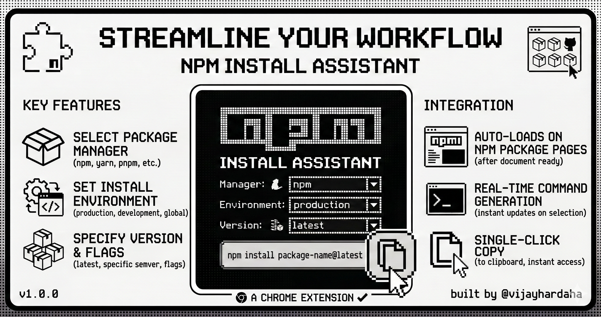
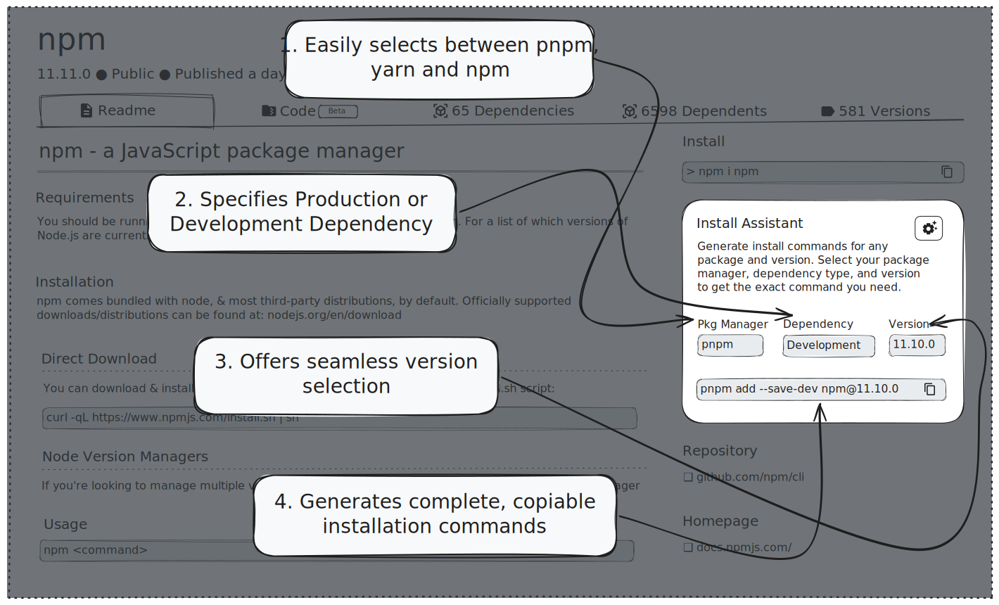

# 🧩 NPM Install Assistant - Chrome Extension

<p align="center">
  
</p>

Tired of repetitive command-line copy-pasta? So was I. 😅 built this React-based interactive installer to make your life easier and your installs perfect.
Enjoy!.

⸻

## 🚀 What Is This?

NPM Install Assistant is a Chrome extension that lives right where you need it — on [npm registry](https://www.npmjs.com/) pages — and generates the exact install command you actually want.

No more:

- Installing with the wrong package manager
- Forgetting dev flags
- Guessing version tags
- Copy-pasting like it’s 2012

You pick your preferences. It builds the perfect command. One click. Done.

⸻

## ⚙️ What It Does

<p align="center">
  
</p>

When you open a package page on npm, the assistant automatically appears and lets you configure your install command with clean, minimal controls.

### 🧠 Smart Configurations

- Select your package manager
    - [npm](https://www.npmjs.com/)
    - [yarn](https://yarnpkg.com/)
    - [pnpm](https://pnpm.io/)
- Choose dependency type
    - Production
    - Development
- Specify version
    - latest
    - specific version
    - [semver](https://semver.org/) tag

And instantly see the final command generated in real time.

⸻

## ✨ Features You’ll Actually Love

### 🔌 Auto-Loads on npm Pages

Open a package. It’s there. No toggling. No setup rituals.

### ⚡ Instant, Correct Command Generation

Switch between [npm](https://www.npmjs.com/), [yarn](https://yarnpkg.com/), [pnpm](https://pnpm.io/) and watch the command adapt instantly.

### 📋 One-Click Copy

Click. Copied. Paste. Done.

### 🎯 Clean Monochrome UI

Minimal black & white design with smooth squircle corners and a modern dev-tool vibe.

### 🧩 Streamlined Workflow

It removes friction from something you do dozens of times a week.

⸻

## 👀 Who Is This For?

This extension is perfect if you:

- Jump between [npm](https://www.npmjs.com/), [yarn](https://yarnpkg.com/), and [pnpm](https://pnpm.io/) projects
- Constantly switch between dev and prod dependencies
- Care about clean commands
- Hate repetitive terminal typing
- Live on [npm registry](https://www.npmjs.com/) pages

Frontend devs, backend devs, indie hackers, OSS contributors — if you install packages, this is for you.

⸻

## 📦 How To Install (From ZIP Release)

1. Go to the [Releases](https://github.com/vijayhardaha/npm-install-assistant-chrome-extension/releases) section of this repository.
2. Download the latest npm-install-assistant.zip file.
3. Extract the ZIP file on your computer.
4. Open [Chrome](https://www.google.com/chrome/) and go to:

    ```
    chrome://extensions
    ```

5. Enable [Developer Mode](https://developer.chrome.com/docs/extensions/get-started/tutorial/hello-world#load-unpacked) (top right).
6. Click [Load unpacked](https://developer.chrome.com/docs/extensions/get-started/tutorial/hello-world#load-unpacked).
7. Select the extracted folder.
8. Done 🎉

Now visit any npm package page and enjoy your new superpower.

⸻

## 🧘 Why It Exists

Because installing packages should feel smooth.

Because typing the same command hundreds of times a year is unnecessary.

Because small tools that remove friction make dev life better.

⸻

## 📜 License

This project is licensed under the [MIT License](LICENSE).

You’re free to use, modify, and distribute it.
If it makes your workflow better, that’s the whole point.

⸻

Happy shipping 🚀
